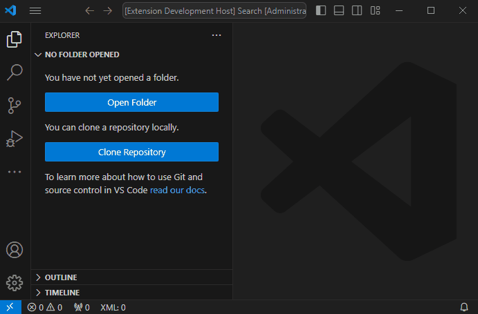

# XML Detector

This is little which extension displays number of XML files in workspace folder or folders.
The main purpose of this extension is to demonstrate how to write simple VS code extension.

## Features

The extension displays number of XML files from all worskaces in the status bar.
Extension is working right from the start of the VS code or you can execute i
manually by `Detect XML files` command from command palette. Extension listens on
create/delete/rename file and when changing workspaces.

## How to run

Just press CTRL+F5 in the extension directory to startup the extension.

## Requirements

No further requiment are needed.

## Extension Settings

No additional settings are provided.

## Release Notes

- detect XML files recursively througouth all workspace folders
- create it's own subtitem into status bar
- listen on workspace events for update

### 1.0.0

Initial release of XML Detector extension.
